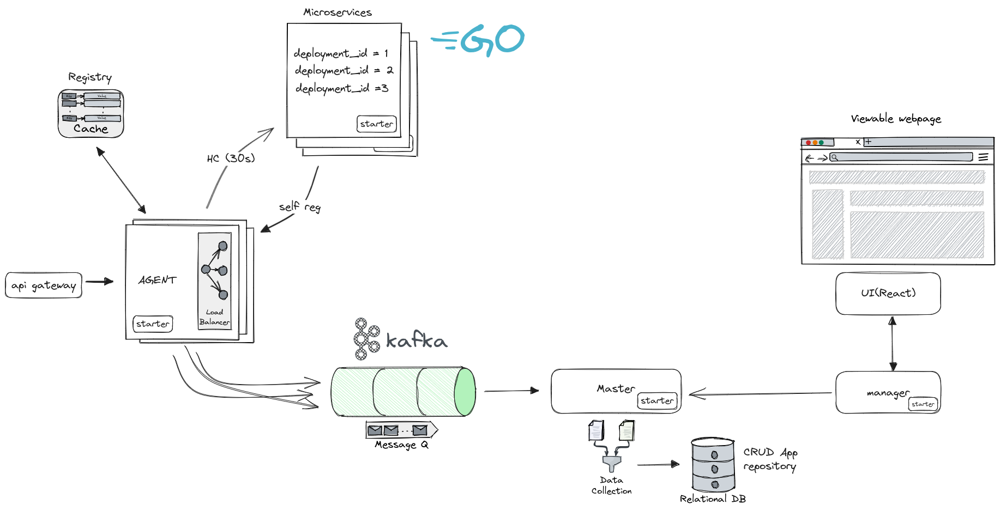

# Discovery Service 

Discovery Service предоставляет механизм для управления и обнаружения микросервисов в распределенной системе.



## Архитектура приложения:

1. **Регистрация служб**: На этапе запуска, экземпляры служб лицензий и организаций регистрируются в службе Master. Они сообщают свои физические адреса, номера портов, а также идентификаторы запускаемых служб (deploymentId, deploymentUnit).
2. **Балансировка нагрузки**: Когда службе лицензий требуется вызвать службу организаций, она использует Master для балансировки нагрузки на стороне клиента. Режим балансировки запрашивается у агента, который высчитывается динамически из текущего состояния здоровья, для получения информации о местоположении искомой службы и помещает ее в локальный кеш.
3. **Синхронизация с Master**: Агент периодически проверяет связь со службой Master и обновляет локальный кеш с адресами служб.
## Компоненты

- **Master**: Основное хранилище, хранит всю топологию. Принимает информацию от агентов и предоставляет API для управления.
- **Agent**: Собирает метрики с зарегистрированных сервисов, проверяет их здоровье и отправляет информацию в Master.
- **Manager**: Интерфейс для управления топологией в Master. Предоставляет возможность вывода из балансировки.
- **UI**: Фронтенд, предоставляющий интерфейс для Manager.

Дополнительно, API gateway обращается к агенту для определения статуса сервиса, действуя как облегченная версия маршрутизатора. Агент, в свою очередь, хранит информацию всех сервисов узла, на котором он развернут.

## TODO:

1. **Написать тесты**
2. **Поиск по группам в Manager**:  Функциональность поиска по группам, например, по `deploymentId`.
2. **Обеспечение консистентности**: Все события агента могут быть записаны через топики Kafka. (пока рано)
3. **Разработка UI**

## Конфигурация

### Общие настройки для всех сервисов:

В файле `application.properties` или `application.yml` вы можете задать следующие параметры:

| Parameter | Description | Default |
|----------|----------|-----------------------|
| `server.servlet.context-path` | Путь контекста Spring | `/` (значение по умолчанию в стартере) |
| `deployment.prefix` | Префикс для `deploymentId` | Главный класс Spring |

Пример:

```yaml
server:
  servlet:
    context-path: /master
deployment:
  prefix: Mr.agentInfo
```

### Настройки для агента:

Для агента вы можете задать дополнительные параметры:

| Parameter                             | Description                                   | Default   |
|---------------------------------------|-----------------------------------------------|-----------|
| `healthcheck.interval`                | Интервал опроса сервисов агентом (в секундах) | 30 секунд |
| `resourceMetrics.collection.interval.seconds` | Интервал между сбором метрик (в секундах)     | 30 секунд |

Пример:

```yaml
healthcheck:
  interval: 30
resourceMetrics:
  collection:
    interval:
      seconds: 30
```

---
## Схема базы данных

### Таблицы:

#### `registered_service`

| Поле | Тип |
|------|-----|
| `id` | BIGSERIAL PRIMARY KEY |
| `deployment_id` | VARCHAR NOT NULL |
| `status` | VARCHAR NOT NULL |
| `system` | VARCHAR NOT NULL |
| `deployment_unit` | VARCHAR NOT NULL |
| `service_url` | VARCHAR NOT NULL |
| `context_path` | VARCHAR NOT NULL |
| `port` | INT NOT NULL |
| `ip` | VARCHAR NOT NULL |
| `registration_time` | TIMESTAMP WITH TIME ZONE NOT NULL |

#### `metrics_service`

| Поле | Тип |
|------|-----|
| `id` | BIGSERIAL PRIMARY KEY |
| `timestamp` | TIMESTAMP WITH TIME ZONE NOT NULL |
| `system_load` | DOUBLE PRECISION NOT NULL |
| `jvm_cpu_load` | DOUBLE PRECISION NOT NULL |
| `used_memory_bytes` | BIGINT NOT NULL |
| `free_memory_bytes` | BIGINT NOT NULL |
| `total_threads` | INT NOT NULL |

### Связи:

- `registered_service` имеет уникальное ограничение на `deployment_id`.
- `metrics_service` имеет внешний ключ, который ссылается на `id` в `registered_service`.
